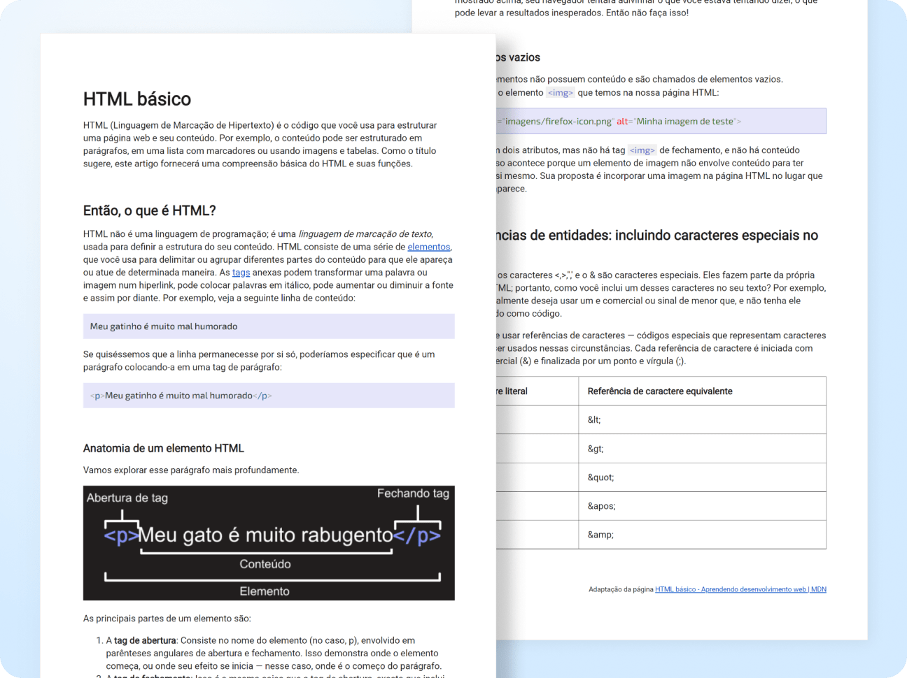

# Projeto 1 Artigo HTML 📑
Este é o meu primeiro projeto que fiz para demonstrar minhas habilidades em desenvolvimento web no Curso 
de Desenvolvimento de Layout em Front-end da Mentorama.

 

## 👨🏾‍💻 Desafio do Projeto
A proposta da tarefa foi desenvolver uma versão adaptada de um artigo contemplando uma introdução ao HTML e CSS.

 

## 📸 Screenshots

 
  
## 🏆 Aprendizado 

- HTML5
- CSS3 Básico

 

## 🧠 Próximos Passos
- Imergir nos estudos sobre HTML e CSS nas próximas tarefas do curso. 

 

## Acesso ao Projeto
Este projeto está hospedado no Vercel. Você pode acessá-lo clicando [aqui](https://projeto-1-artigo-html.vercel.app/).

